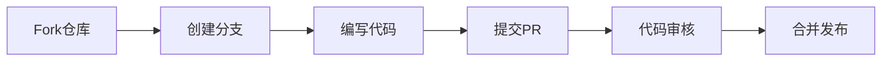

<div align="center">


# 🎓 校园搭子

**让每一次相遇都恰到好处**


<br/>


</div>

---

## 📖 项目简介

**校园搭子** 是一款专为大学生设计的兴趣匹配社交平台。通过智能算法，帮助同学们找到志同道合的"搭子"——无论是学习伙伴、运动搭档、还是一起探店的美食搭子。

> 💡 **搭子文化**：一种新型社交方式，"搭子"指的是在特定场景下一起做事的伙伴，轻松无压力，专注共同兴趣。

---

## 🌟 核心亮点

<table>
<tr>
<td width="50%">

### 🎯 智能匹配
- 40+兴趣标签自由选择
- 目标强度匹配（轻松/适中/认真）
- 时间节奏同步（灵活/固定）
- 相处模式问卷

</td>
<td width="50%">

### ⭐ 信用分体系
- 互评机制保障质量
- 100分满分制
- 全5星才能满分
- 好评率实时统计

</td>
</tr>
<tr>
<td width="50%">

### 💬 实时聊天
- 流畅的聊天体验
- 表情输入支持
- 消息气泡动画
- 匹配房间私聊

</td>
<td width="50%">

### 📅 每日签到
- 连续签到奖励翻倍
- 校园币积分系统
- 签到成功弹窗动画
- 激励持续参与

</td>
</tr>
</table>

---

## 🚀 快速体验

### 一键启动

```bash
# 克隆项目
git clone https://github.com/MMDXTMM/Campus-partners.git

# 进入目录
cd Campus-partners

# 启动服务
python server.py
```

### 访问应用

打开浏览器访问：**http://localhost:8080**

### 测试账号

| 用户名 | 密码 |
|:------:|:----:|
| `test1` | `123456` |

---

## 📱 功能展示

<div align="center">

| 注册流程 | 随机匹配 | 实时聊天 |
|:--------:|:--------:|:--------:|
| 三步式注册 | 一键匹配 | 流畅对话 |
| 兴趣选择 | 偏好设置 | 表情支持 |

</div>

---

## 🏗️ 技术架构

```
┌─────────────────────────────────────────────────────┐
│                    前端层                            │
│  ┌─────────┐  ┌─────────┐  ┌─────────┐  ┌─────────┐ │
│  │  HTML5  │  │  CSS3   │  │   JS    │  │ Fetch   │ │
│  └─────────┘  └─────────┘  └─────────┘  └─────────┘ │
└─────────────────────────────────────────────────────┘
                        │ HTTP API
┌─────────────────────────────────────────────────────┐
│                    后端层                            │
│  ┌─────────────────────────────────────────────┐   │
│  │           Python HTTPServer                  │   │
│  │  ┌───────┐ ┌───────┐ ┌───────┐ ┌───────┐    │   │
│  │  │ Auth  │ │ Match │ │ Chat  │ │ Credit│    │   │
│  │  └───────┘ └───────┘ └───────┘ └───────┘    │   │
│  └─────────────────────────────────────────────┘   │
└─────────────────────────────────────────────────────┘
                        │ SQLite
┌─────────────────────────────────────────────────────┐
│                    数据层                            │
│  ┌────────┐ ┌────────┐ ┌────────┐ ┌────────┐       │
│  │ Users  │ │ Match  │ │ Message│ │ Rating │       │
│  └────────┘ └────────┘ ┌────────┐ ┌────────┐       │
│                    │ CheckIn │ │ Tokens │           │
│                    └────────┘ └────────┘           │
└─────────────────────────────────────────────────────┘
```

---

## 📂 项目结构

```
Campus-partners/
│
├── 📄 server.py          # 后端服务入口
├── 📁 templates/
│   └── 📄 index.html     # 前端单页应用
│
├── 📁 data/
│   └── 🗄️ campus_buddy.db  # SQLite数据库
│
├── 📁 campus-buddy-plan/ # 产品规划文档
├── 📁 register-flow/     # 注册流程设计
│
├── 📄 .gitignore
├── 📄 LICENSE
└── 📄 README.md
```

---

## 🗃️ 数据模型

| 表名 | 字段 | 说明 |
|:-----|:-----|:-----|
| `users` | id, username, nickname, school, interests, credit_score | 用户核心信息 |
| `match_rooms` | id, user1_id, user2_id, status | 匹配房间记录 |
| `messages` | id, room_id, sender_id, content | 聊天消息存储 |
| `ratings` | id, room_id, rater_id, rating, comment | 用户互评记录 |
| `check_ins` | id, user_id, check_in_date, coins_earned | 签到奖励记录 |
| `tokens` | token, user_id, created_at | 登录令牌管理 |

---

## 🎨 设计理念

- **简洁至上**：原生技术栈，无框架依赖
- **移动优先**：响应式设计，适配各种设备
- **用户友好**：流畅动画，即时反馈
- **安全可靠**：密码加密，Token认证

---

## 🤝 参与贡献

我们欢迎所有形式的贡献！



### 贡献步骤

1. 🍴 Fork 本仓库
2. 🌿 创建特性分支 `git checkout -b feature/AmazingFeature`
3. ✨ 编写代码并测试
4. 💾 提交更改 `git commit -m 'Add AmazingFeature'`
5. 📤 推送分支 `git push origin feature/AmazingFeature`
6. 🎉 提交 Pull Request

---

## 📜 开源许可

本项目基于 **MIT License** 开源，意味着你可以自由使用、修改和分发。

详见 [LICENSE](LICENSE) 文件。

---

<div align="center">

### ⭐ 如果这个项目对你有帮助，请给一个 Star！


<br/>
<br/>

**Made with 💜 by Campus Buddy Team**

*让校园生活更精彩*

</div>