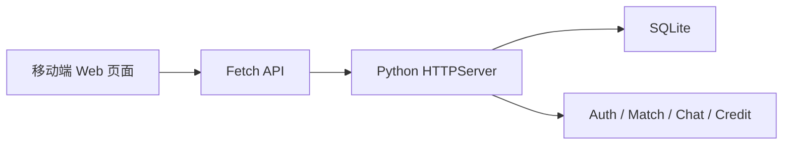

<div align="center">

# Campus Buddy | 校园搭子

让大学生快速找到同校、同频、同目标的学习、运动和生活搭子。


</div>

---

## 项目简介

**校园搭子** 是一个面向大学生的同校兴趣匹配平台。它把“找人一起做事”拆成明确场景：学习备考、运动健身、探店娱乐、日常陪伴等，并通过兴趣标签、目标强度、时间节奏和互动偏好帮助用户找到更合适的搭子。

项目当前是一个轻量 Web MVP：后端使用 Python 原生 `HTTPServer`，数据存储使用 SQLite，前端使用原生 HTML/CSS/JavaScript，适合快速演示、课程项目展示和小规模产品验证。

## 核心能力

| 模块 | 能力说明 |
| --- | --- |
| 用户系统 | 注册、登录、Token 鉴权、个人资料维护 |
| 兴趣匹配 | 支持随机匹配和定向匹配，按兴趣、学校和偏好筛选 |
| 匹配房间 | 生成一对一匹配房间，沉淀匹配记录 |
| 实时聊天 | 在匹配房间内发送和读取消息 |
| 信用分 | 基于互评结果维护用户信用分与好评率 |
| 校园币 | 每日签到、匹配消耗、积分激励 |

## 产品亮点

- **校园场景优先**：以学校为天然信任边界，降低陌生社交的距离感。
- **搭子类型清晰**：学习、运动、娱乐、生活陪伴等场景分层，减少无效匹配。
- **目标强度匹配**：区分轻度尝试、稳定计划、强目标用户，避免节奏不一致。
- **信用分约束**：通过互评和信用分让优质行为得到正反馈。
- **移动端优先**：主界面按手机宽度设计，适合宿舍、图书馆、操场等碎片化场景使用。

## 快速开始

```bash
git clone https://github.com/MMDXTMM/Campus-partners.git
cd Campus-partners
python server.py
```

启动后访问：

```text
http://localhost:8080
```

默认测试账号：

| 用户名 | 密码 |
| --- | --- |
| `test1` | `123456` |

## 项目结构

```text
Campus-partners/
├── server.py                    # 后端服务入口与 API
├── templates/
│   └── index.html               # 前端单页应用
├── data/
│   └── campus_buddy.db          # 本地 SQLite 数据库
├── campus-buddy-plan/           # 产品规划页面
├── register-flow/               # 注册流程原型
├── LICENSE
└── README.md
```

## 技术架构



## API 概览

| 类型 | 路径示例 | 说明 |
| --- | --- | --- |
| Auth | `/api/register`, `/api/login`, `/api/me` | 注册、登录、获取当前用户 |
| Profile | `/api/profile` | 更新昵称、学校、兴趣、联系方式等资料 |
| Match | `/api/match/random`, `/api/match/directed` | 发起随机或定向匹配 |
| Chat | `/api/messages`, `/api/messages/send` | 获取和发送房间消息 |
| Rating | `/api/rate` | 对匹配对象评分并影响信用分 |
| Check-in | `/api/checkin`, `/api/checkin/status` | 每日签到与奖励查询 |

## 数据模型

| 表名 | 说明 |
| --- | --- |
| `users` | 用户账号、资料、兴趣、校园币和信用分 |
| `match_rooms` | 匹配房间、双方用户、匹配类型和状态 |
| `messages` | 聊天消息记录 |
| `ratings` | 匹配后的互评记录 |
| `check_ins` | 每日签到记录和奖励 |
| `tokens` | 登录 Token 和用户关联 |

## 适合展示的改进方向

- 接入 WebSocket，让聊天从轮询升级为实时推送。
- 增加后台管理页，用于审核举报、查看匹配质量和用户增长。
- 将匹配算法从标签交集升级为加权相似度模型。
- 增加校园邮箱或学生身份验证，强化平台信任边界。
- 将 SQLite 抽象为可替换的数据层，便于迁移到 MySQL/PostgreSQL。

## 许可证

本项目基于 [MIT License](LICENSE) 开源。

---

<div align="center">

如果这个项目对你有帮助，欢迎 Star。

</div>
